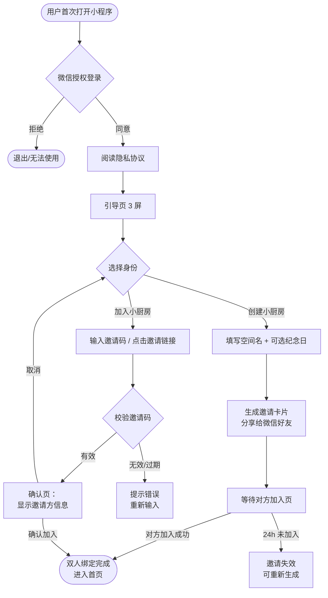
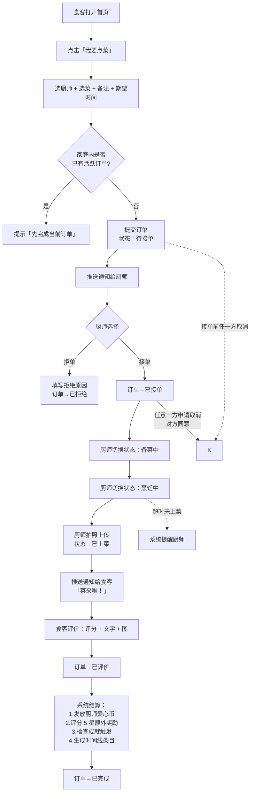
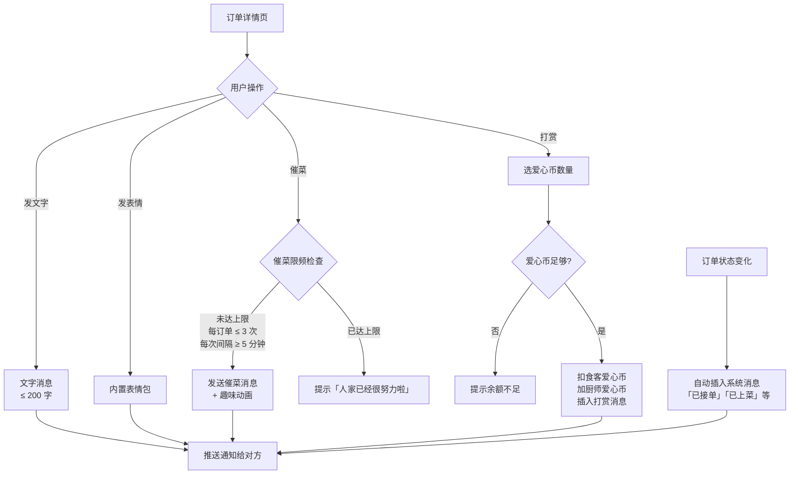
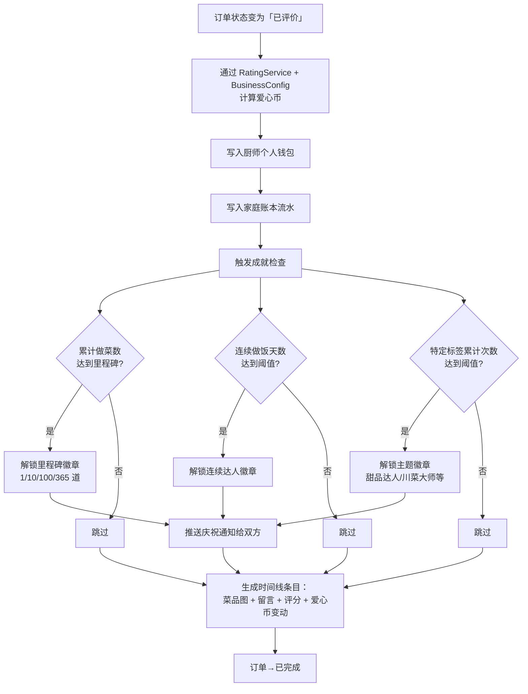
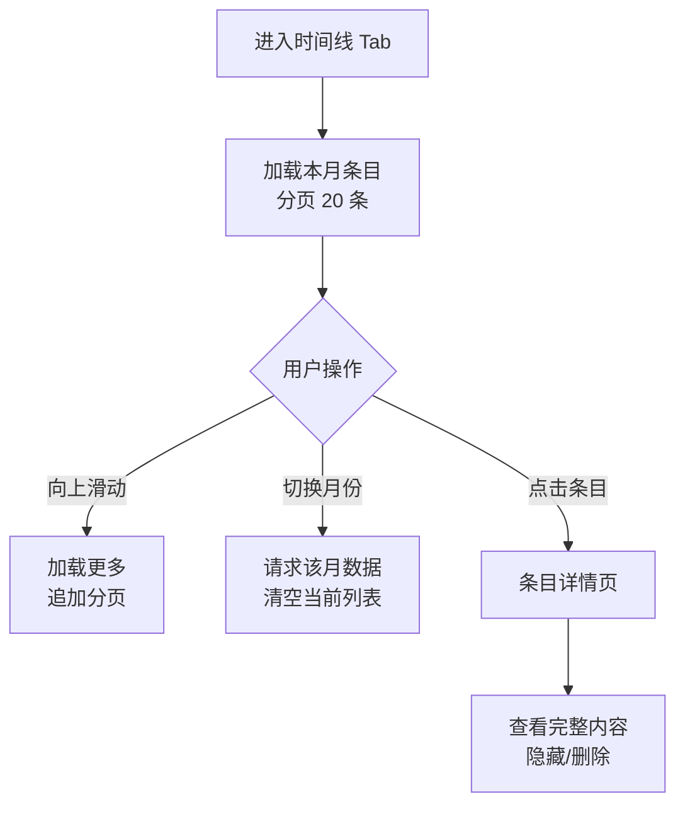
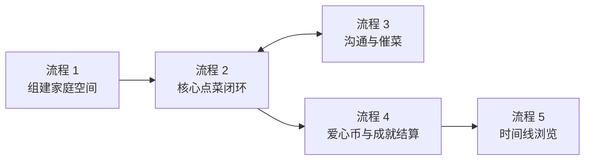

# 情侣厨房 —— 核心用户流程

> 本文档描述 5 个核心用户流程，每个流程包含文字说明 + Mermaid 流程图。
> 配合 [信息架构](./03-information-architecture.md) 中的状态机阅读。

---

## 1. 新用户首次进入并组建家庭空间

### 1.1 场景说明

小 A 收到对象小 B 分享的小程序链接（或微信群里看到推荐）。首次打开后，需要完成：

1. 微信授权登录
2. 阅读隐私协议
3. 选择"创建小厨房"或"加入小厨房"
4. 创建方生成邀请码 / 分享卡片 → 等待对方
5. 双方都进入后绑定成功，进入主页面

### 1.2 流程图

### 1.3 异常分支与边界

- **邀请码过期**（24h）：提示双方重新生成
- **用户已属于其他家庭**：提示"退出当前家庭才能加入新的"
- **创建方撤回邀请**：等待方收到提示
- **双方同时操作**：以服务端时间戳为准，后到者收到"已绑定"提示

---

## 2. 食客点菜 → 厨师接单 → 上菜 → 评价

### 2.1 场景说明

**这是产品的核心闭环**，决定了整个产品能不能跑通。

- 食客（小 A）：在菜单选菜，指定厨师小 B，备注口味，下单
- 厨师（小 B）：收到通知，可接单 / 拒单
- 接单后：厨师手动更新进度（备菜 → 烹饪 → 即将出锅）
- 上菜：厨师拍照，订单进入"已上菜"
- 评价：食客评分 + 文字 + 可选打赏
- 结算：系统自动发放爱心币、生成时间线条目

### 2.2 流程图

### 2.3 关键约束

| 节点           | 规则                                                      |
| -------------- | --------------------------------------------------------- |
| 创建订单       | 单家庭同时只允许 1 个活跃订单                             |
| 拒单           | 必须填写原因，文案不强制但鼓励                            |
| 接单后取消     | 需要对方确认，避免单方面破坏体验                          |
| 已上菜后       | 不可取消，只能评价或不评价                                |
| 评价超时       | 上菜后 24h 未评价，系统默认 5 星 + "未评价"标识，仍然结算 |
| 爱心币发放公式 | `基础 5 + 难度 × 2 + (评分 - 3) × 2 (评分 ≤ 3 不扣分)`    |

---

## 3. 订单内沟通与催菜

### 3.1 场景说明

订单进行中，双方在订单消息流里互动：

- 食客可以追加备注、发表情、催菜
- 厨师可以汇报"火大了"、"少了一味"，让食客感到参与
- 催菜按钮带趣味动画，但限频，避免变成压力

### 3.2 流程图

### 3.3 催菜限频规则

- 每订单最多催 3 次
- 两次催菜间隔 ≥ 5 分钟
- 厨师状态为"烹饪中"才允许催（"备菜中"不允许）
- 已上菜后催菜按钮置灰

---

## 4. 订单完成后的爱心币流转与成就触发

### 4.1 场景说明

订单评价完成后，系统在后台完成一系列结算：

1. 通过 RatingService + BusinessConfig 计算并发放厨师爱心币
2. 写入个人钱包流水 + 家庭账本流水
3. 触发成就检查（累计菜数、连续天数、特定菜品次数等）
4. 生成时间线条目
5. 解锁成就时推送庆祝通知

### 4.2 流程图

### 4.3 失败处理

- 任一步骤失败（例如爱心币写入失败），订单保持"已评价"状态，由定时任务重试
- 成就检查失败不影响主流程，独立异步任务
- 时间线生成失败可后补，不阻塞订单完结

---

## 5. 查看时间线

### 5.1 场景说明

- 用户日常浏览：进入"时间线" Tab，瀑布流看历史餐食
- 按月份切换查看不同时期的记录

### 5.2 流程图

### 5.3 边界与异常

- 隐藏条目仅自己看不到，对方仍可见（部分实现，字段存在，前端逻辑不完整）

---

## 流程之间的联动关系

流程 1 是前置条件，流程 2 是主干，流程 3 在流程 2 进行中并行发生，流程 4 由流程 2 触发，流程 5 是流程 4 的下游产物。
