# 情侣厨房 —— 数据模型草图

> 本文档是**产品视角**的数据模型，目的是让所有人理解"产品有哪些实体、它们怎么关联"。
> **不是**最终的数据库设计（不含具体字段类型、索引、SQL）—— 那是后续技术文档的范畴。
> 配合 [PRD](./01-prd-overview.md) 和 [功能清单](./02-feature-list.md) 阅读。

---

## 1. 实体清单

### 1.1 User（用户）

| 字段                    | 含义         | 说明                            |
| ----------------------- | ------------ | ------------------------------- |
| user_id                 | 主键         | 内部 ID                         |
| wx_openid               | 微信 openid  | 登录凭证                        |
| phone                   | 手机号       | H5 登录用，可空                 |
| password                | 密码哈希     | H5 登录用，可空                 |
| nickname                | 昵称         | 默认拉微信，可改                |
| avatar_url              | 头像         | 默认拉微信                      |
| signature               | 个性签名     | 可空                            |
| status                  | 账号状态     | `active` / `deleted`（软删除）  |
| current_family_id       | 当前所属家庭 | MVP 1:1，可空（未加入任何家庭） |
| created_at / updated_at | 时间戳       | 通用字段                        |

### 1.2 Family（家庭空间）

| 字段                   | 含义           | 说明                                                |
| ---------------------- | -------------- | --------------------------------------------------- |
| family_id              | 主键           |                                                     |
| name                   | 空间名         | 默认"XX 和 XX 的小厨房"                             |
| relation_type          | 关系类型       | `couple` / `family`，MVP 默认 couple                |
| anniversary_date       | 纪念日         | 可空                                                |
| invite_code            | 当前邀请码     | 可重新生成；24h 失效                                |
| invite_code_expires_at | 邀请码过期时间 |                                                     |
| creator_user_id        | 创建者         | 用于权限判定（如转让）                              |
| status                 | 状态           | `active` / `dissolving` / `dissolved`                |
| created_at             | 创建时间       |                                                     |

### 1.3 FamilyMember（家庭-用户关系）

| 字段             | 含义     | 说明                 |
| ---------------- | -------- | -------------------- |
| family_member_id | 主键     |                      |
| family_id        | 所属家庭 |                      |
| user_id          | 用户     |                      |
| role             | 角色     | `creator` / `member` |
| joined_at        | 加入时间 |                      |
| left_at          | 离开时间 | 软删除，可恢复       |

> ⚠️ MVP 设计：每个 user_id 在所有有效 FamilyMember 中只能出现 1 次（即一人只能在一个家庭）。但表结构本身支持 N:N，便于后续扩展。

### 1.4 Recipe（菜谱）

| 字段                    | 含义       | 说明                  |
| ----------------------- | ---------- | --------------------- |
| recipe_id               | 主键       |                       |
| family_id               | 所属家庭   | 严格隔离              |
| name                    | 菜名       | 必填                  |
| image_urls              | 图片列表   | 0~5 张                |
| difficulty              | 难度       | 1–5                   |
| meal_tags               | 时段标签   | 早/午/晚/夜宵（多选） |
| flavor_tags             | 口味标签   | 甜/咸/辣/清淡（多选） |
| notes                   | 备注       | 食谱说明、注意事项    |
| created_by_user_id      | 创建者     |                       |
| is_deleted              | 软删除标记 | 不影响历史订单引用    |
| order_count             | 被点过次数 | 冗余字段，方便排序    |
| avg_rating              | 平均评分   | 冗余字段              |
| created_at / updated_at |            |                       |

### 1.5 Order（订单）

| 字段                     | 含义               | 说明         |
| ------------------------ | ------------------ | ------------ |
| order_id                 | 主键               |              |
| family_id                | 所属家庭           |              |
| customer_user_id         | 食客               |              |
| chef_user_id             | 厨师               |              |
| status                   | 状态               | 见状态机     |
| expected_serve_at        | 期望上菜时间       |              |
| customer_notes           | 食客整体备注       | "今天清淡点" |
| reject_reason            | 拒单原因           | 仅在拒单时有 |
| total_love_points        | 本订单产生的爱心币 | 完成后写入   |
| created_at / updated_at  |                    |              |
| served_at / completed_at | 上菜 / 完成时间    |              |

**状态枚举**：
`draft` / `pending`（待接单）/ `accepted`（已接单）/ `prepping`（备菜中）/ `cooking`（烹饪中）/ `served`（已上菜）/ `rated`（已评价）/ `completed`（已完成）/ `rejected`（已拒绝）/ `cancelled`（已取消）

### 1.6 OrderItem（订单菜品行）

| 字段            | 含义           | 说明                       |
| --------------- | -------------- | -------------------------- |
| order_item_id   | 主键           |                            |
| order_id        | 所属订单       |                            |
| recipe_id       | 菜谱引用       |                            |
| recipe_snapshot | 菜谱快照       | JSON：菜谱被删除后仍能展示 |
| custom_notes    | 单道菜定制备注 | "麻婆豆腐少辣"             |
| sort_order      | 排序           | 一个订单可以有多道菜       |

> 设计要点：菜谱可能被删除或重命名，订单需要保留**当时下单的快照**才能正确显示历史。

### 1.7 OrderMessage（订单消息）

| 字段           | 含义     | 说明                                                                 |
| -------------- | -------- | -------------------------------------------------------------------- |
| message_id     | 主键     |                                                                      |
| order_id       | 所属订单 |                                                                      |
| sender_user_id | 发送者   | 系统消息为空                                                         |
| type           | 类型     | `text` / `emoji` / `system` / `rush`（催菜）/ `tip`（打赏）/ `image` |
| content        | 内容     | JSON：根据类型差异化                                                 |
| read_at        | 已读时间 | 用于已读回执                                                         |
| created_at     |          |                                                                      |

### 1.8 Rating（评价）

| 字段              | 含义             | 说明             |
| ----------------- | ---------------- | ---------------- |
| rating_id         | 主键             |                  |
| order_id          | 所属订单（唯一） |                  |
| rater_user_id     | 评价者（食客）   |                  |
| stars             | 1–5 星           | 必填             |
| comment           | 文字评价         | 可空             |
| image_urls        | 评价图片         | 可空             |
| is_auto_generated | 是否系统默认评价 | 24h 超时自动生成 |
| created_at        |                  |                  |

### 1.9 LovePointLog（爱心币流水）

| 字段             | 含义           | 说明                                                                                   |
| ---------------- | -------------- | -------------------------------------------------------------------------------------- |
| log_id           | 主键           |                                                                                        |
| family_id        | 所属家庭       | 用于家庭账本                                                                           |
| user_id          | 个人钱包归属   |                                                                                        |
| change_amount    | 变动数量       | 正负                                                                                   |
| balance_after    | 变动后余额     | 个人钱包维度                                                                           |
| change_type      | 变动类型       | `cook_reward` / `rating_bonus` / `tip_send` / `tip_receive` / `check_in` / `refund` 等 |
| source_order_id  | 来源订单       | 可空（签到等无订单关联）                                                               |
| description      | 描述           | 可读文本                                                                               |
| reversible_until | 可撤回截止时间 | 24h，过期不可撤回                                                                      |
| is_reversed      | 是否已被撤回   |                                                                                        |
| created_at       |                |                                                                                        |

> **双账本设计**：
>
> - **个人钱包视角**：基于 `user_id` 聚合，看自己赚了多少花了多少
> - **家庭账本视角**：基于 `family_id` 聚合，看家庭内总流转量
>   同一条流水同时被两个视角索引，无需冗余两份。

### 1.10 Achievement（成就）

| 字段            | 含义       | 说明                                     |
| --------------- | ---------- | ---------------------------------------- |
| achievement_id  | 主键       |                                          |
| owner_type      | 所有者类型 | `user`（个人成就）/ `family`（家庭成就） |
| owner_id        | 所有者 ID  | 对应 user_id 或 family_id                |
| badge_key       | 徽章标识符 | 如 `cook_streak_7` / `family_first_100`  |
| unlocked_at     | 解锁时间   |                                          |
| source_order_id | 触发的订单 | 可空                                     |
| metadata        | 元数据     | JSON：解锁时的快照数据                   |

> 徽章定义存储在 **BadgeDefinition** 数据库表（约 55 条定义），支持管理员通过后台动态管理。每种徽章的 evaluatorType、thresholds 等配置均存在表中。

### 1.11 TimelineEntry（时间线条目）

| 字段                            | 含义       | 说明                                          |
| ------------------------------- | ---------- | --------------------------------------------- |
| entry_id                        | 主键       |                                               |
| family_id                       | 所属家庭   |                                               |
| source_type                     | 来源类型   | `order`（订单自动生成）/ `manual`（手动补记） |
| source_order_id                 | 关联订单   | source_type=order 时必填                      |
| occurred_at                     | 发生时间   | 用于排序                                      |
| image_urls                      | 图片       |                                               |
| customer_user_id / chef_user_id | 涉及的双人 | 订单条目继承自订单                            |
| customer_comment                | 食客留言   | 来自 Rating.comment                           |
| chef_comment                    | 厨师留言   | P1：上菜时可填一段话                          |
| hidden_by_user_id               | 隐藏者     | 用于"仅自己不可见"                            |
| created_at                      |            |                                               |

### 1.12 BadgeDefinition（徽章定义）

| 字段             | 含义           | 说明                                                      |
| ---------------- | -------------- | --------------------------------------------------------- |
| id               | 主键           |                                                           |
| key              | 徽章标识符     | 唯一，如 `cook_streak_7` / `family_first_100`             |
| name             | 徽章名称       | 如"连续做菜 7 天"                                          |
| description      | 徽章描述       | 解锁条件说明                                              |
| category         | 分类           | `personal` / `family` / `special`                         |
| evaluator_type   | 评估器类型     | count / streak / sum / time_check / special_date 等 10+ 种 |
| thresholds       | 阈值配置       | JSON：不同等级对应的阈值                                   |
| is_active        | 是否启用       | 管理员可停用                                              |
| icon             | 图标           | 徽章图标标识                                              |
| created_at       |                |                                                           |

> 约 55 条预置定义通过 `prisma/seed-badges.ts` 种子脚本写入，管理员可通过后台动态管理。

### 1.13 ChefLevelDefinition（厨师等级定义）

| 字段       | 含义       | 说明                          |
| ---------- | ---------- | ----------------------------- |
| id         | 主键       |                               |
| level      | 等级序号   | 1/2/3/4/5                     |
| name       | 等级名称   | 学徒 → 厨师 → 大厨 → 主厨 → 主厨之神 |
| min_orders | 最低订单数 | 达到该等级所需累计完成订单数  |
| avg_rating | 最低评分   | 达到该等级所需的平均评分      |
| icon       | 等级图标   |                               |

### 1.14 Feedback（用户反馈）

| 字段          | 含义       | 说明                        |
| ------------- | ---------- | --------------------------- |
| id            | 主键       |                             |
| user_id       | 提交用户   |                             |
| content       | 反馈内容   |                             |
| platform      | 平台来源   | mini-app / admin / h5       |
| status        | 处理状态   | `pending` / `resolved`      |
| contact_info  | 联系方式   | 可空                        |
| created_at    |            |                             |

### 1.15 BusinessConfig（业务配置）

| 字段        | 含义     | 说明                                       |
| ----------- | -------- | ------------------------------------------ |
| id          | 主键     |                                            |
| key         | 配置键   | 唯一，如 `love_point_base` / `rating_bonus` |
| value       | 配置值   | JSON，支持复杂结构                          |
| schema      | 值约束   | JSON Schema，校验用                         |
| description | 配置说明 |                                            |
| updated_at  |          |                                            |

### 1.16 BusinessConfigChange（配置变更记录）

| 字段         | 含义         | 说明                    |
| ------------ | ------------ | ----------------------- |
| id           | 主键         |                         |
| config_id    | 关联配置     |                         |
| old_value    | 变更前值     | JSON                    |
| new_value    | 变更后值     | JSON                    |
| changed_by   | 操作人       | 管理员 user_id          |
| created_at   |              |                         |

### 1.17 NotificationLog（通知记录）

| 字段         | 含义     | 说明                                          |
| ------------ | -------- | --------------------------------------------- |
| id           | 主键     |                                               |
| user_id      | 接收用户 |                                               |
| type         | 通知类型 | `order_status` / `achievement` / `system` 等  |
| title        | 通知标题 |                                               |
| content      | 通知内容 |                                               |
| is_read      | 是否已读 |                                               |
| created_at   |          |                                               |

---

## 2. 关系示意图（ER Diagram）

```mermaid
erDiagram
    User ||--o{ FamilyMember : belongs_to
    Family ||--o{ FamilyMember : has
    Family ||--o{ Recipe : owns
    Family ||--o{ Order : contains
    Family ||--o{ TimelineEntry : contains
    Family ||--o{ LovePointLog : accounts

    User ||--o{ Order : "as customer"
    User ||--o{ Order : "as chef"
    User ||--o{ LovePointLog : owns
    User ||--o{ Achievement : "personal achievements"
    User ||--o{ Feedback : submits
    User ||--o{ NotificationLog : receives
    Family ||--o{ Achievement : "family achievements"

    Order ||--o{ OrderItem : has
    Order ||--o{ OrderMessage : contains
    Order ||--|| Rating : "has one"
    Order ||--o| TimelineEntry : "generates"
    Order ||--o{ LovePointLog : "settles"

    Recipe ||--o{ OrderItem : "referenced by"

    BadgeDefinition ||--o{ Achievement : defines

    BusinessConfig ||--o{ BusinessConfigChange : tracks

    User {
        string user_id PK
        string wx_openid
        string phone
        string nickname
        string status
        string current_family_id FK
    }

    Family {
        string family_id PK
        string name
        string relation_type
        string status
    }

    FamilyMember {
        string family_member_id PK
        string family_id FK
        string user_id FK
        string role
    }

    Recipe {
        string recipe_id PK
        string family_id FK
        string name
        int difficulty
    }

    Order {
        string order_id PK
        string family_id FK
        string customer_user_id FK
        string chef_user_id FK
        string status
    }

    OrderItem {
        string order_item_id PK
        string order_id FK
        string recipe_id FK
        json recipe_snapshot
    }

    OrderMessage {
        string message_id PK
        string order_id FK
        string sender_user_id FK
        string type
    }

    Rating {
        string rating_id PK
        string order_id FK
        int stars
    }

    LovePointLog {
        string log_id PK
        string user_id FK
        string family_id FK
        int change_amount
        string change_type
    }

    Achievement {
        string achievement_id PK
        string owner_type
        string owner_id
        string badge_key
    }

    TimelineEntry {
        string entry_id PK
        string family_id FK
        string source_type
        string source_order_id FK
    }

    BadgeDefinition {
        string id PK
        string key
        string name
        string category
        string evaluator_type
        json thresholds
    }

    ChefLevelDefinition {
        string id PK
        int level
        string name
        int min_orders
    }

    Feedback {
        string id PK
        string user_id FK
        string content
        string status
    }

    BusinessConfig {
        string id PK
        string key
        json value
    }

    BusinessConfigChange {
        string id PK
        string config_id FK
        json old_value
        json new_value
    }

    NotificationLog {
        string id PK
        string user_id FK
        string type
        boolean is_read
    }
```

---

## 3. 关键设计取舍

### 3.1 爱心币：个人钱包 vs 家庭账本？

**取舍**：双账本（同一条流水同时被两个视角消费）。

| 视角     | 用途                     | 显示位置                         |
| -------- | ------------------------ | -------------------------------- |
| 个人钱包 | "我赚了 / 我花了多少"    | 我的页爱心币卡片、打赏时校验余额 |
| 家庭账本 | "我们家爱心币流转活跃度" | 月度回顾、年度报告               |

**为什么不只做家庭账本**：打赏需要"扣食客钱包、加厨师钱包"，必须有个人维度的余额。

**为什么不只做个人钱包**：家庭账本是统计的天然抓手，避免每次都从两个人的流水合并。

### 3.2 时间线：按订单生成 vs 独立条目？

**取舍**：订单完成时**自动生成 1 条**（source_type=order），同时**允许手动补记**（source_type=manual）。

- 自动条目和订单是 1:1，订单完成才生成
- 手动条目独立存在，不挂订单，但仍归属家庭
- 删除订单不会自动删除时间线条目（保留回忆）

### 3.3 菜谱删除：物理删 vs 软删 vs 快照？

**取舍**：菜谱本身**软删除**，OrderItem 同时存**菜谱 ID + 当时的菜谱快照（JSON）**。

- 软删除：用户视角看不到，但订单引用仍然有效
- 快照：菜谱被改名/改图后，历史订单仍展示当时的菜名和图

### 3.4 多家庭支持：MVP 1:1 还是 N:N？

**取舍**：表结构 N:N（FamilyMember 中间表），但**应用层强制 1:1**（MVP 阶段）。

- 优点：未来开放多家庭时不用迁数据库
- 实现：服务端在创建 FamilyMember 前校验"该用户没有其他 active FamilyMember"

### 3.5 订阅消息 / 通知：单独表还是借用 OrderMessage？

**取舍**：使用独立的 `NotificationLog` 表记录通知历史，便于管理后台查看和用户查阅。
订单消息流中的系统消息仍通过 `OrderMessage` 实现，与通知记录互不干扰。

---

## 4. 数据完整性约束（产品层面）

| 约束                 | 描述                                                                                           |
| -------------------- | ---------------------------------------------------------------------------------------------- |
| 家庭隔离             | 所有跨实体查询必须按 `family_id` 过滤；服务端中间件统一注入                                    |
| 订单唯一活跃         | 同一 family_id 下，状态在 `{pending, accepted, prepping, cooking, served}` 的订单同时最多 1 单 |
| 评价唯一             | 一个订单只能有一条 Rating（数据库唯一约束）                                                    |
| 爱心币流水不可改     | 只追加（append-only），撤回通过反向流水实现，不修改原记录                                      |
| 时间线条目对家庭可见 | 隐藏 (hidden_by_user_id) 是软隐藏，对方仍可见                                                  |
| 用户删除限制         | 用户注销前必须先退出家庭空间                                                                   |

---

## 5. 后续技术文档应补充

> 本文档不覆盖以下技术细节，由后续 RFC / 技术文档完成：

- 数据库选型（推荐 PostgreSQL 或 MySQL）
- 具体字段类型、长度、索引设计
- 唯一约束、外键约束实现方式
- 缓存策略（菜谱列表、爱心币余额是否需要 Redis）
- 微信订阅消息模板 ID 管理
- 图片存储方案（OSS / COS）
- 分库分表策略（MVP 不需要）
- API 接口规范

---

## 6. 已确认设计细节

### 6.1 催菜消息独立类型 `rush`

`OrderMessage.type` 中 `rush` 作为独立枚举值，**不复用 text + flag** 的方案。理由：

- 服务端按 type 做限频检查（每订单 ≤ 3 次、间隔 ≥ 5 分钟）逻辑集中、可单测
- 前端按 type 渲染专属趣味动画，不需要解析消息体
- 后续做"催菜次数统计"等查询无需扫消息内容

### 6.2 成就徽章定义使用数据库表

徽章定义存储在 `BadgeDefinition` 数据库表（约 55 条预置定义），通过 `evaluator_type` 字段标识不同评估器类型（count / streak / sum / time_check / special_date 等 10+ 种），`thresholds` 字段存储 JSON 格式的阈值配置。管理员可通过后台动态管理（增删改查、启用/停用）。理由：

- 支持运行时动态管理，无需重新部署即可调整徽章配置
- 管理后台可直接 CRUD，运营友好
- 种子脚本 `prisma/seed-badges.ts` 负责初始化

### 6.3 多家庭切换（P2）：保留历史归属，新家庭从零

当 P2 阶段开放"一人可属于多家庭"时：

- `LovePointLog` 始终绑定原 `family_id`，跨家庭不可见
- `Achievement` 中 `owner_type=user` 的徽章跟随用户、`owner_type=family` 的留在原家庭
- 用户进入新家庭时个人钱包余额按家庭维度独立计算，新家庭从 0 起步

理由：爱心币是"在那段关系里的回忆"，跟着用户跑会有违和感；个人成就是用户自己的，可以带走。
